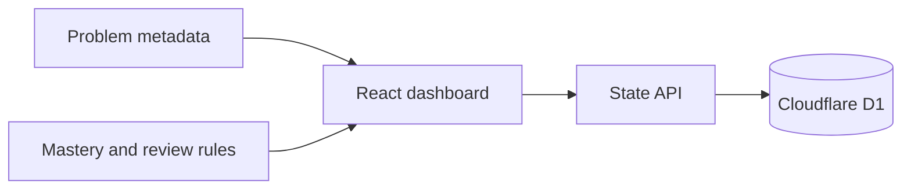

# LeetCode Review Site

**TypeScript · React · Vinext · Cloudflare D1 · Drizzle**

A personal interview-practice dashboard that turns a problem list into a repeatable review routine. Track solved problems, rate mastery and see what needs another pass.

## Features

- Curated problem metadata with links to the original problem pages.
- Mastery ratings and scheduled review dates.
- Monthly mastery decay to surface material that needs refreshing.
- Custom problem entries and an activity history.
- Local SQLite-compatible D1 persistence rather than browser-only state.

## Run locally

Requires Node.js 22.13 or later.

```bash
npm ci
npm run practice
```

The command builds the app, applies local database migrations and starts a local Worker preview. Open the loopback URL printed by the command. For development use `npm run dev` after preparing the database.

## Architecture



`app/api/state/route.ts` reads and updates progress, `db/schema.ts` defines storage, and `lib/mastery.ts` applies time-based mastery decay. Deployment/runtime details are in [the runtime guide](docs/runtime-guide.md).

## Scope

This edition is a single-user local practice tool. Its progress API does not isolate users; deploy behind access control if hosting personal progress. LeetCode and curated problem-list names belong to their respective owners; this project is not affiliated with them. Generated databases, personal progress, environment files and deployment state are excluded from the repository.
